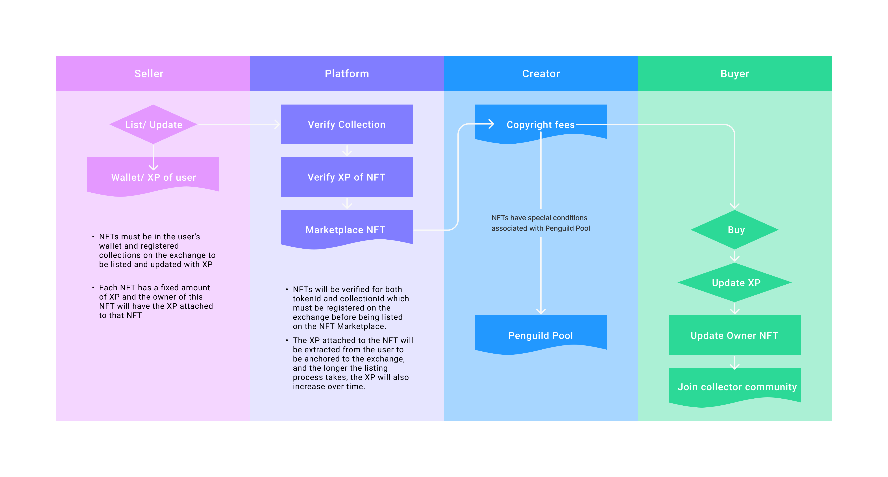

# **NFT Marketplace Platform: 0xpenGuildWTF**

**0xpenGuildWTF** is a pioneering NFT Marketplace that bridges the thriving blockchain ecosystems of Ethereum and Polkadot. As a connector platform, we are more than just a marketplace; we are a bridge where users from both ecosystems can create, mint, and trade NFTs while discovering new opportunities through this unique integration.


## **Team Members**  

- **SaitamaCoder** - Lead, Blockchain developer, Fullstack developer, Researcher 
- **Key(Andrew)** - Researcher ,Blockchain developer 
- **Lou1s** - Fullstack developer
- **PiNguyen** - UI/UX  
- **Contact Information:** 0xpenguildwtf@gmail.com

## **Development Guidelines**  

- Fork the repo : https://github.com/AceXeus/0xpenGuildWTF  


## **Mission**  

To create an innovative and unique platform that:  

- Empowers users to create, mint, and trade NFTs effortlessly.  
- Encourages creativity and rewards community contributions.  
- Bridges the gap between two distinct blockchain cultures, fostering collaboration and interaction.  


## **Key Features**  

1. **A Cross-Culture NFT Marketplace**  
   - Seamlessly integrates Ethereum and Polkadot, allowing communities from both chains to interact.  
   - Provides a unified space for users to exchange ideas, culture, and digital assets.  

2. **Randomized NFT Minting Mechanism**  
   - Users can mint NFTs with attributes, rarity levels, and values that are entirely randomized.  
   - NFTs are categorized into rarity tiers: Common, Rare, Epic, Legendary, with special rewards for rare mints.  

3. **Platform Token and Reward System**  
   - Platform tokens reward the most active participants:  
     - Top Minters: Users who mint the most NFTs.  
     - Top Creators: NFT creators with the highest XP scores.  
   - Gas Fees distribution:  
     - 70% to the collection’s reward pool for creators of special NFTs.  
     - 30% to the platform’s token pool for rewarding contributors.  

4. **Gamification and Community Engagement**  
   - Users can earn tokens or items by completing tasks or participating in events.  
   - Limited-time minting events drive engagement and FOMO.  

5. **Value for Users**  
   - **For Creators:** Tools for minting NFTs, access to both communities, and platform token rewards.  
   - **For Collectors:** Exciting randomized minting experiences and ownership of rare NFTs.  
   - **For the Community:** Collaboration between Ethereum and Polkadot, enhancing NFT liquidity.  


## **Technical Stack**  

- **Languages and Frameworks:** React, TypeScript, Solidity, Viem, Wagmi
- **Blockchain/Protocol:** Ethereum, Polkadot


## **How It Works**  

### Architecture  
- High-level architecture integrating Ethereum and Polkadot for seamless interaction.  
- Includes smart contract deployment, NFT minting logic, and a reward mechanism.  


### Architecture Diagram

- **Mint NFT On Platform** :


- **Blockchain Interact Layer** :


- **Trade NFT on Marketplace**



- **Reward Distribution and Governance**


### ROADMAP

Our development roadmap is divided into 4 major phases:

#### Phase 1: Foundation (Q1 2025)
- Complete NFT Marketplace smart contracts development
- Implement XP and reward systems
- Launch beta version on Moonbase Alpha testnet and Westend testnet
- Establish randomized NFT minting mechanism

#### Phase 2: Cross-Chain Integration (Q2 2025)
- Integrate bridge between Ethereum and Polkadot networks
- Deploy token and reward distribution system
- Launch NFT collection creation and management features
- Optimize marketplace user experience

#### Phase 3: Community & Growth (Q3-Q4 2025)
- Launch time-limited NFT minting events
- Expand gamification system and community missions
- Integrate additional blockchains (Solana, Avalanche)
- Develop analytics tools for creators and collectors

#### Phase 4: Innovation & Expansion (2026)
- Implement decentralized platform governance
- Expand ecosystem with DeFi applications
- Develop GameFi and metaverse marketplace integration
- Optimize platform performance and scalability

### Video demo

[](https://www.youtube.com/watch?v=aqCzEQ9IWX0)

➡️ [Watch the video demo on YouTube](https://www.youtube.com/watch?v=aqCzEQ9IWX0)

### Demo Instructions  

1. **Clone the Repository**  
   - Open your terminal or command prompt.  
   - Run the following command to clone the project repository:
     
     ```bash
     
     git clone [https://github.com/AceXeus/0xpenGuildWTF.git](https://github.com/AceXeus/0xpenGuildWTF.git)
     
     ```  
   - Navigate to the project directory:
      
     ```bash
     
     cd 0xpenGuildWTF
     
     ```  

2. **Install Dependencies**  
   - Ensure you have **Node.js** and **npm** installed on your system.  
   - Run the following command to install the required dependencies:  
     ```bash
     npm install
     ```  

3. **Start the Development Server**  
   - Once the dependencies are installed, start the development server using:  
     ```bash
     npm run dev
     ```  
   - The application will be accessible at `http://localhost:3000`.
       
4. Connect your wallet and start minting or trading NFTs.  


## **Challenges**  

- Integrating Ethereum and Polkadot with seamless cross-chain communication.  
- Designing a fair and engaging randomized minting mechanism.  
- Encouraging collaboration between two distinct blockchain communities.  


## **Future Development**  

- Expand cross-chain capabilities to include other blockchains like Solana or Avalanche.  
- Introduce decentralized governance for platform evolution.  
- Develop advanced analytics tools for creators and collectors.  
